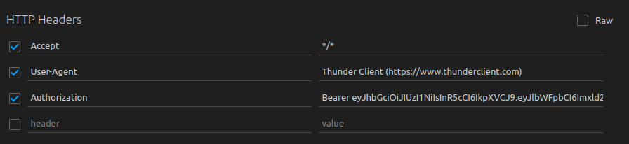

# Lendary Smith API

Loja de itens medievais personalizados, no formato de uma _API_, utilizando _Typescript_ e _Sequelize_. A aplicação contém _endpoints_ que dão suporte a operações de criação, leitura e atualização de informações. Além de utilizar _JWT_ para autenticar algumas rotas.

## Instalação e Como Utilizar

<details>
  <summary><strong>🐳 Especificações sobre uso do Docker</strong></summary>

#### Após clonar o repositório, navegue até a raíz do projeto e instale as dependências com o comando:

```bash
npm install
```

> Rode os serviços `app-trybesmith` e `db` com o comando `docker-compose up -d --build`.

- Lembre-se de parar o `mysql` se estiver usando localmente na porta padrão (`3306`), ou adapte, caso queria fazer uso da aplicação em containers
- Esses serviços irão inicializar um container chamado `trybesmith_api` e outro chamado `trybesmith_db`.
- A partir daqui você pode rodar o container `trybesmith_api` via CLI ou abri-lo no VS Code.

  > Rode o comando `npm run db:reset` (este comando vai funcionar somente após a criação do tipos solicitados no requisito) para criar o banco de dados, as tabelas que serão utilizadas e populá-las.

  > Use o comando `docker exec -it trybesmith_api bash` para entrar no container.

  - Ele te dará acesso ao terminal interativo do container criado pelo compose, que está rodando em segundo plano.

- Para visualizar o logs do nodemon em seu terminal use os seguintes comandos:

  > `docker ps`: para visualizar os containers ativos e pegar o `CONTAINER ID`;

  > `docker logs -f <id_do_container>`: para visualizar os logs do seu servidor com nodemon;

</details>

<details>
  <summary><strong>🎲 Diagrama Entidade Relacionamento</strong></summary>
  O banco de dados do projeto segue a estrutura abaixo:

  

  O banco contém três tabelas: pessoas usuárias (`users`), produtos (`products`) e pedidos (`orders`).

</details>

## Funcionalidades

> <strong>OBS:</strong> Na raiz do projeto, você encontrará um arquivo Thunder Client (thunder-collection_Legendary Smith.json) que pode ser importado no Thunder Client para facilitar as requisições.

- **Login:**

  - Endpoint: `POST /login`
  - Retorna um token de acesso caso o usuário já esteja cadastrado no banco de dados.
  - O corpo da requisição deve conter o nome de usuário e a senha, seguindo o formato abaixo:

     ```json
    {
       "username": "Hagar",
       "password": "terrível"
    }
    ```
  - Efetuando o login corretamente retornará um token neste formato:
  
    ```json
    {
      "token": "eyJhbGciOiJI[...]"
    }
    ```

    > Aviso: Para cadastrar um novo produto ou pedido, é necessário utilizar esse token de acesso no header da requisição como no exemplo abaixo: </br>
     

#

- **Listar Produtos:**

  - Endpoint: `GET /products`

- **Listar Pedidos:**
  - Endpoint: `GET /orders`

- **Criar Produto:**
  - Endpoint: `POST /products`
  - O corpo da requisição deve estar neste formato abaixo:
  
     ```json
     {
       "name": "Martelo de Thor",
       "price": "30 peças de ouro",
       "orderId": 4
    }
    ```
<!-- - **Criar Pedido:**  

  - Endpoint: `POST /orders`
  - O corpo da requisição deve estar neste formato abaixo:
  
     ```json
     {
       "productIds": [1, 2],
       "userId": 1
    }
    ``` -->

## Contribuição

Este projeto está aberto para contribuições. Se você deseja contribuir, siga estas etapas:

1. Faça um fork do projeto
2. Crie uma nova branch (`git checkout -b feature/sua-feature`)
3. Faça commit das alterações (`git commit -m 'Adicione sua feature'`)
4. Faça push para a branch (`git push origin feature/sua-feature`)
5. Abra um Pull Request

## Contato

Se você deseja entrar em contato comigo, sinta-se à vontade para enviar um e-mail para [jonataslaguna.js@gmail.com](mailto:jonataslaguna.js@gmail.com).
